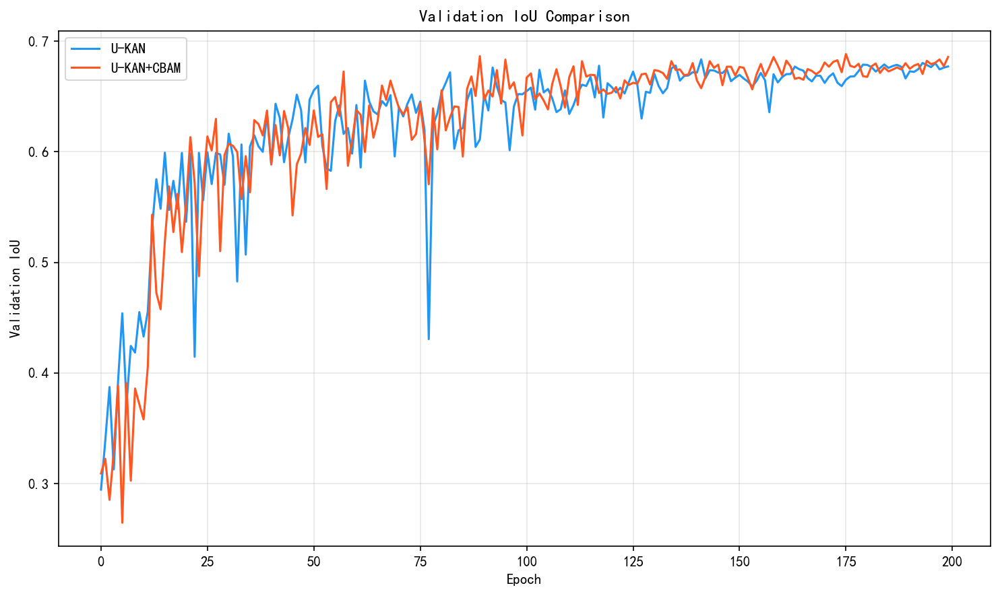
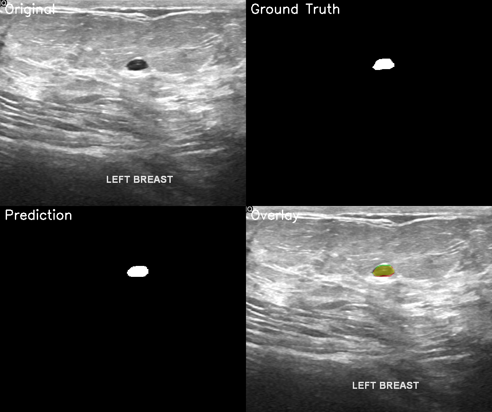

# U-KAN Makes Strong Backbone for Medical Image Segmentation and Generation

<p align="center">
  <a href="https://arxiv.org/abs/2406.02918"></a>
  <a href="https://opensource.org/licenses/MIT"></a>
  <a href="https://www.python.org/downloads/release/python-390/"></a>
  <a href="https://pytorch.org/"></a>
</p>

:pushpin: This is an official PyTorch implementation of **U-KAN Makes Strong Backbone for Medical Image Segmentation and Generation**

---

## 🚀 课程设计：U-KAN 复现与改进

本仓库在原论文基础上，完成了 **BUSI 数据集复现** 并提出 **U-KAN+CBAM 改进方案**。

### 📊 实验结果对比

| 模型 | Val Dice | Val IoU | 参数量 |
|------|----------|---------|--------|
| U-KAN (Baseline) | 0.7997 | 0.6835 | 6.32M |
| **U-KAN+CBAM (Ours)** | **0.8062** | **0.6883** | 6.36M |
| 提升 | **+0.65%** | **+0.70%** | +0.6% |

### 📈 训练曲线对比

| Dice | IoU | Loss |
|------|-----|------|
|  |  |  |

### 🔬 改进方法

<p align="center">
  
</p>

在 U-KAN 的 skip connection 处添加 **CBAM (Convolutional Block Attention Module)** 注意力机制：
- **通道注意力**：学习哪些特征通道对病灶分割更重要
- **空间注意力**：学习图像哪些区域是病灶位置

### 📁 项目结构

```
U-KAN/
├── Seg_UKAN/           # 分割模型代码
│   ├── archs.py        # 模型架构 (UKAN, UKAN_CBAM)
│   ├── cbam.py         # CBAM 注意力模块
│   ├── train.py        # 训练脚本
│   └── predict.py      # 预测可视化
├── Diffusion_UKAN/     # 扩散模型代码
├── scripts/            # 工具脚本
├── docs/               # 文档和报告
└── assets/             # 图片资源
```

### 🚀 快速开始

```bash
# 1. 克隆仓库
git clone https://github.com/<your-username>/U-KAN.git
cd U-KAN

# 2. 创建环境
conda create -n ukan python=3.9
conda activate ukan
pip install -r Seg_UKAN/requirements.txt

# 3. 训练 U-KAN+CBAM
cd Seg_UKAN
python train.py --arch UKAN_CBAM --dataset BUSI_processed --data_dir ../datasets \
    --input_w 256 --input_h 256 --batch_size 4 --epochs 200 \
    --name busi_ukan_cbam --output_dir ../outputs
```

### 🖼️ 分割效果展示

<p align="center">
  
</p>

### 📄 详细文档

| 文档 | 描述 |
|------|------|
| [BUSI 数据集复现报告](docs/BUSI_UKAN_复现报告.md) | 数据预处理、训练配置、复现结果 |
| [U-KAN+CBAM 改进报告](docs/UKAN_CBAM_改进报告.md) | CBAM 模块设计、实验对比分析 |

---

[[`Project Page`](https://yes-u-kan.github.io/)] [[`arXiv`](https://arxiv.org/abs/2406.02918)] [[`BibTeX`](#citation)]

<p align="center">
  
</p>

> [**U-KAN Makes Strong Backbone for Medical Image Segmentation and Generation**](https://arxiv.org/abs/2406.02918)<br>
> [Chenxin Li](https://xggnet.github.io/)<sup>1\*</sup>, [Xinyu Liu](https://xinyuliu-jeffrey.github.io/)<sup>1\*</sup>, [Wuyang Li](https://wymancv.github.io/wuyang.github.io/)<sup>1\*</sup>, [Cheng Wang](https://scholar.google.com/citations?user=AM7gvyUAAAAJ&hl=en)<sup>1\*</sup>, [Hengyu Liu](https://liuhengyu321.github.io/)<sup>1</sup>, [Yifan Liu](https://yifliu3.github.io/)<sup>1</sup>, [Chen Zhen](https://franciszchen.github.io/)<sup>2</sup>, [Yixuan Yuan](https://www.ee.cuhk.edu.hk/~yxyuan/people/people.htm)<sup>1✉</sup><br> <sup>1</sup>The Chinese Univerisity of Hong Kong, <sup>2</sup>Centre for Artificial Intelligence and Robotics, Hong Kong

We explore the untapped potential of Kolmogorov-Anold Network (aka. KAN) in improving backbones for vision tasks. We investigate, modify and re-design the established U-Net pipeline by integrating the dedicated KAN layers on the tokenized intermediate representation, termed U-KAN. Rigorous medical image segmentation benchmarks verify the superiority of U-KAN by higher accuracy even with less computation cost. We further delved into the potential of U-KAN as an alternative U-Net noise predictor in diffusion models, demonstrating its applicability in generating task-oriented model architectures. These endeavours unveil valuable insights and sheds light on the prospect that with U-KAN, you can make strong backbone for medical image segmentation and generation.

<div align="center">
    
</div>

## 📰News

 **[NOTE]** Random seed is essential for eval metric, and all reported results are calculated over three random runs with seeds of 2981, 6142, 1187, following rolling-UNet. We think most issues are related with this.

**[2024.10]** U-KAN is accepted by AAAI-25. 

**[2024.6]** Some modifications are done in Seg_UKAN for better performance reproduction. The previous code can be quickly updated by replacing the contents of train.py and archs.py with the new ones.

**[2024.6]** Model checkpoints and training logs are released!

**[2024.6]** Code and paper of U-KAN are released!

## 💡Key Features
- The first effort to incorporate the advantage of emerging KAN to improve established U-Net pipeline to be more **accurate, efficient and interpretable**.
- A Segmentation U-KAN with **tokenized KAN block to effectively steer the KAN operators** to be compatible with the exiting convolution-based designs.
- A Diffusion U-KAN as an **improved noise predictor** demonstrates its potential in backboning generative tasks and broader vision settings.

## 🛠Setup

```bash
git clone https://github.com/CUHK-AIM-Group/U-KAN.git
cd U-KAN
conda create -n ukan python=3.10
conda activate ukan
cd Seg_UKAN && pip install -r requirements.txt
```

**Tips A**: We test the framework using pytorch=1.13.0, and the CUDA compile version=11.6. Other versions should be also fine but not totally ensured.


## 📚Data Preparation
**BUSI**:  The dataset can be found [here](https://www.kaggle.com/datasets/aryashah2k/breast-ultrasound-images-dataset). 

**GLAS**:  The dataset can be found [here](https://websignon.warwick.ac.uk/origin/slogin?shire=https%3A%2F%2Fwarwick.ac.uk%2Fsitebuilder2%2Fshire-read&providerId=urn%3Awarwick.ac.uk%3Asitebuilder2%3Aread%3Aservice&target=https%3A%2F%2Fwarwick.ac.uk%2Ffac%2Fcross_fac%2Ftia%2Fdata%2Fglascontest&status=notloggedin). 
<!-- You can directly use the [processed GLAS data]() without further data processing. -->
**CVC-ClinicDB**:  The dataset can be found [here](https://www.dropbox.com/s/p5qe9eotetjnbmq/CVC-ClinicDB.rar?e=3&dl=0). 
<!-- You can directly use the [processed CVC-ClinicDB data]() without further data processing. -->

We also provide all the [pre-processed dataset](https://mycuhk-my.sharepoint.com/:f:/g/personal/1155206760_link_cuhk_edu_hk/ErDlT-t0WoBNlKhBlbYfReYB-iviSCmkNRb1GqZ90oYjJA?e=hrPNWD) without requiring any further data processing. You can directly download and put them into the data dir.


The resulted file structure is as follows.
```
Seg_UKAN
├── inputs
│   ├── busi
│     ├── images
│           ├── malignant (1).png
|           ├── ...
|     ├── masks
│        ├── 0
│           ├── malignant (1)_mask.png
|           ├── ...
│   ├── GLAS
│     ├── images
│           ├── 0.png
|           ├── ...
|     ├── masks
│        ├── 0
│           ├── 0.png
|           ├── ...
│   ├── CVC-ClinicDB
│     ├── images
│           ├── 0.png
|           ├── ...
|     ├── masks
│        ├── 0
│           ├── 0.png
|           ├── ...
```

## 🔖Evaluating Segmentation U-KAN

You can directly evaluate U-KAN from the checkpoint model. Here is an example for quick usage for using our **pre-trained models** in [Segmentation Model Zoo](#segmentation-model-zoo):
1. Download the pre-trained weights and put them to ```{args.output_dir}/{args.name}/model.pth```
2. Run the following scripts to 
```bash
cd Seg_UKAN
python val.py --name ${dataset}_UKAN --output_dir [YOUR_OUTPUT_DIR] 
```

## ⏳Training Segmentation U-KAN

You can simply train U-KAN on a single GPU by specifing the dataset name ```--dataset``` and input size ```--input_size```.
```bash
cd Seg_UKAN
python train.py --arch UKAN --dataset {dataset} --input_w {input_size} --input_h {input_size} --name {dataset}_UKAN  --data_dir [YOUR_DATA_DIR]
```
For example, train U-KAN with the resolution of 256x256 with a single GPU on the BUSI dataset in the ```inputs``` dir:
```bash
cd Seg_UKAN
python train.py --arch UKAN --dataset busi --input_w 256 --input_h 256 --name busi_UKAN  --data_dir ./inputs
```
Please see Seg_UKAN/scripts.sh for more details.
Note that the resolution of glas is 512x512, differing with other datasets (256x256).

**[Quick Update]** Please follow the seeds of 2981, 6142, 1187 to fully reproduce the paper experimental results. All compared methods are evaluated on the same seed setting.

## 🎪Segmentation Model Zoo
We provide all the pre-trained model [checkpoints](https://mycuhk-my.sharepoint.com/:f:/g/personal/1155206760_link_cuhk_edu_hk/Ej6yZBSIrU5Ds9q-gQdhXqwBbpov5_MaWF483uZHm2lccA?e=rmlHMo)
Here is an overview of the released performance&checkpoints. Note that results on a single run and the reported average results in the paper differ.
|Method| Dataset | IoU | F1  | Checkpoints |
|-----|------|-----|-----|-----|
|Seg U-KAN| BUSI | 65.26 | 78.75 | [Link](https://mycuhk-my.sharepoint.com/:f:/g/personal/1155206760_link_cuhk_edu_hk/EjktWkXytkZEgN3EzN2sJKIBfHCeEnJnCnazC68pWCy7kQ?e=4JBLIc)|
|Seg U-KAN| GLAS | 87.51 | 93.33 | [Link](https://mycuhk-my.sharepoint.com/:f:/g/personal/1155206760_link_cuhk_edu_hk/EunQ9KRf6n1AqCJ40FWZF-QB25GMOoF7hoIwU15fefqFbw?e=m7kXwe)|
|Seg U-KAN| CVC-ClinicDB | 85.61 | 92.19 | [Link](https://mycuhk-my.sharepoint.com/:f:/g/personal/1155206760_link_cuhk_edu_hk/Ekhb3PEmwZZMumSG69wPRRQBymYIi0PFNuLJcVNmmK1fjA?e=5XzVSi)|

The parameter ``--no_kan'' denotes the baseline model that is replaced the KAN layers with MLP layers. Please note: it is reasonable to find occasional inconsistencies in performance, and the average results over multiple runs can reveal a more obvious trend.
|Method| Layer Type | IoU | F1  | Checkpoints |
|-----|------|-----|-----|-----|
|Seg U-KAN (--no_kan)| MLP Layer  | 63.49 |	77.07 | [Link](https://mycuhk-my.sharepoint.com/:f:/g/personal/1155206760_link_cuhk_edu_hk/EmEH_qokqIFNtP59yU7vY_4Bq4Yc424zuYufwaJuiAGKiw?e=IJ3clx)|
|Seg U-KAN| KAN Layer |  65.26 | 78.75  | [Link](https://mycuhk-my.sharepoint.com/:f:/g/personal/1155206760_link_cuhk_edu_hk/EjktWkXytkZEgN3EzN2sJKIBfHCeEnJnCnazC68pWCy7kQ?e=4JBLIc)|

## 🎇Medical Image Generation with Diffusion U-KAN

Please refer to [Diffusion_UKAN](./Diffusion_UKAN/README.md)


## 🛒TODO List
- [X] Release code for Seg U-KAN.
- [X] Release code for Diffusion U-KAN.
- [X] Upload the pretrained checkpoints.


## 🎈Acknowledgements
Greatly appreciate the tremendous effort for the following projects!
- [CKAN](https://github.com/AntonioTepsich/Convolutional-KANs)
- [CBAM](https://github.com/Jongchan/attention-module) - Convolutional Block Attention Module

## 🤝Contributing

欢迎贡献代码！请查看 [CONTRIBUTING.md](CONTRIBUTING.md) 了解详情。

## 📜Citation
If you find this work helpful for your project, please consider citing the following paper:
```bibtex
@article{li2024ukan,
  title={U-KAN Makes Strong Backbone for Medical Image Segmentation and Generation},
  author={Li, Chenxin and Liu, Xinyu and Li, Wuyang and Wang, Cheng and Liu, Hengyu and Yuan, Yixuan},
  journal={arXiv preprint arXiv:2406.02918},
  year={2024}
}
```
