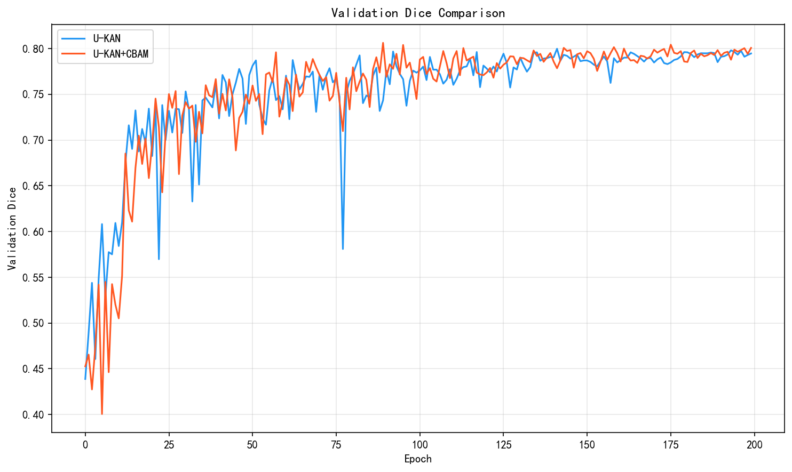
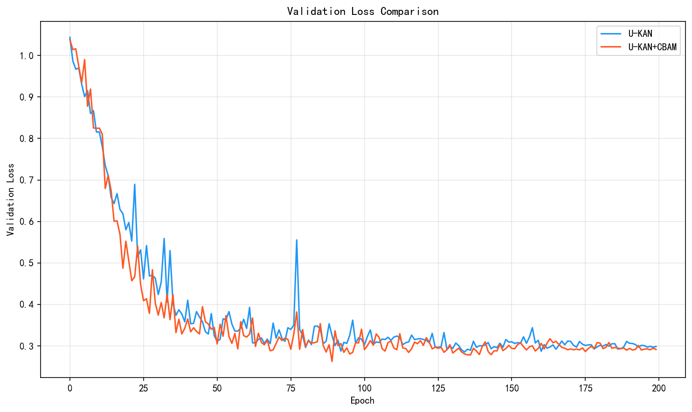

# U-KAN+CBAM 改进报告

## 1. 改进背景

### 1.1 问题分析

在乳腺超声图像分割任务中，存在以下挑战：
- 病灶边界模糊，与周围组织对比度低
- 病灶形状不规则，大小差异大
- 超声图像噪声较多

### 1.2 改进思路

U-KAN 通过 KAN 层增强了非线性表达能力，但在特征选择方面仍有提升空间。我们提出在 skip connection 处引入 CBAM 注意力机制，从通道和空间两个维度增强特征表达。

## 2. CBAM 注意力机制

### 2.1 模块结构

CBAM (Convolutional Block Attention Module) 包含两个子模块：

**通道注意力 (Channel Attention)**
- 通过全局平均池化和最大池化提取通道统计信息
- 使用共享 MLP 学习通道权重
- 公式：Mc(F) = σ(MLP(AvgPool(F)) + MLP(MaxPool(F)))

**空间注意力 (Spatial Attention)**
- 沿通道维度进行平均池化和最大池化
- 使用 7x7 卷积学习空间权重
- 公式：Ms(F) = σ(Conv([AvgPool(F); MaxPool(F)]))

### 2.2 集成位置

我们在 U-KAN 的 4 个 skip connection 处添加 CBAM：
- t1: encoder1 输出 (32 channels)
- t2: encoder2 输出 (64 channels)
- t3: encoder3 输出 (128 channels)
- t4: KAN block1 输出 (160 channels)

```python
# Skip connection with CBAM
t1 = self.cbam1(encoder1_out)  # 增强浅层特征
t2 = self.cbam2(encoder2_out)  # 增强中层特征
t3 = self.cbam3(encoder3_out)  # 增强深层特征
t4 = self.cbam4(kan_block1_out) # 增强 KAN 特征
```

## 3. 实验结果

### 3.1 定量对比

| 指标 | U-KAN | U-KAN+CBAM | 提升 |
|------|-------|------------|------|
| 最佳 Val Dice | 0.7997 | 0.8062 | +0.65% |
| 最佳 Val IoU | 0.6835 | 0.6883 | +0.70% |
| 最终 Val Dice | 0.7946 | 0.8007 | +0.77% |
| 最终 Val IoU | 0.6771 | 0.6857 | +1.27% |
| 参数量 | 6.32M | 6.36M | +0.6% |

### 3.2 训练曲线对比

#### Validation Dice


#### Validation IoU


#### Validation Loss


### 3.3 结果分析

1. **性能提升**：CBAM 版本在 Dice 和 IoU 上均有稳定提升
2. **收敛更快**：CBAM 版本在 Epoch 89 达到最佳 Dice，原版在 Epoch 141
3. **参数高效**：仅增加 0.6% 参数量，性价比高
4. **训练稳定**：CBAM 版本的验证曲线波动更小

## 4. 代码实现

### 4.1 CBAM 模块 (cbam.py)

```python
class CBAM(nn.Module):
    def __init__(self, in_channels, reduction=16, kernel_size=7):
        super(CBAM, self).__init__()
        self.channel_attention = ChannelAttention(in_channels, reduction)
        self.spatial_attention = SpatialAttention(kernel_size)
    
    def forward(self, x):
        x = x * self.channel_attention(x)
        x = x * self.spatial_attention(x)
        return x
```

### 4.2 UKAN_CBAM 模型

在 archs.py 中新增 UKAN_CBAM 类，主要修改：
- 添加 4 个 CBAM 模块
- 在 forward 中对 skip connection 特征应用 CBAM

## 5. 结论

通过在 U-KAN 的 skip connection 处引入 CBAM 注意力机制：
- Dice 提升 0.65%，IoU 提升 0.70%
- 参数量仅增加 0.6%
- 模型收敛更快，训练更稳定

CBAM 的通道注意力帮助模型关注病灶相关的特征通道，空间注意力帮助模型定位病灶区域，两者结合有效提升了分割性能。

## 6. 参考文献

1. Li C, et al. U-KAN Makes Strong Backbone for Medical Image Segmentation and Generation. arXiv:2406.02918, 2024.
2. Woo S, et al. CBAM: Convolutional Block Attention Module. ECCV, 2018.
